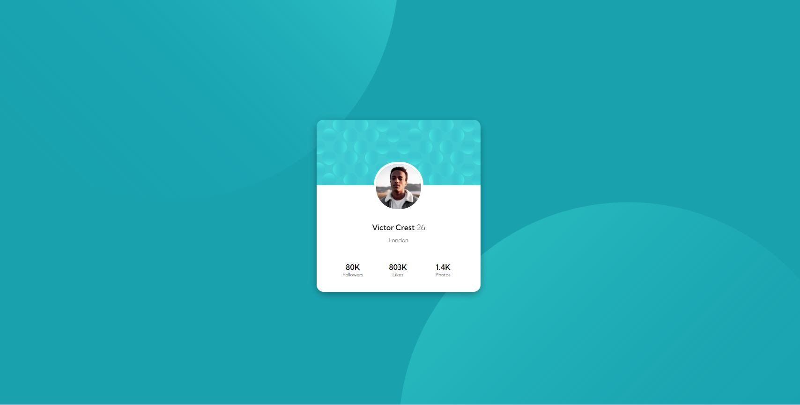

# Frontend Mentor - Profile card component solution

This is a solution to the [Profile card component challenge on Frontend Mentor](https://www.frontendmentor.io/challenges/profile-card-component-cfArpWshJ). Frontend Mentor challenges help you improve your coding skills by building realistic projects. 

## Overview

### The challenge

- Build out the project to the designs provided

### Screenshot

### Links

- Live Site URL:  (https://jvmcpheron.github.io/profile-card)

## My process

### Built with

- Semantic HTML5 markup
- CSS
- Flexbox

### What I learned

I learned about fixed positioning, and how it can be used to move around images. Honestly I learned a lot through this process about positioning in general.

## Author

- Website - [Jane McPheron](https://jvmcpheron.github.io/Bootstrap_Portfolio/)
- Frontend Mentor - [@jvmcpheron](https://www.frontendmentor.io/profile/jvmcpheron)

## Acknowledgments

Hunter, my friend, helped me! His github: https://github.com/HunterMcGrew